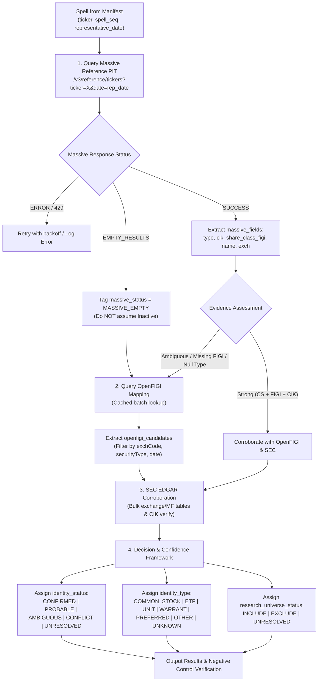

# Implementation Plan: Experimental Historical Security Identity Resolver (v1)

Build and execute an **experimental, read-only historical security identity resolver** to empirically evaluate the point-in-time multi-tiered identity architecture before attempting full-universe resolution.

The core research objective is to verify whether the pipeline:
$$\text{Ticker Spell} \longrightarrow \text{Representative Date} \longrightarrow \text{Massive PIT} \longrightarrow \text{OpenFIGI Fallback} \longrightarrow \text{SEC Corroboration} \longrightarrow \text{Identity Decision} \longrightarrow \text{Universe Filter}$$
correctly identifies historical securities and **reliably avoids false identity merges**, particularly for ticker reuse cases.

---

## User Review Required

> [!IMPORTANT]
> **API Execution Time & Rate Limits**:
> The `MASSIVE_API_KEY` is on the standard 5 requests/minute tier (~12.5s per request). For our proposed **350-spell stratified sample** (~50 already cached, ~300 live queries), the execution will take approximately **60–65 minutes**.
> The experiment script is architected with persistent disk caching (`data/identity/experiments/resolver_v1/api_cache/`) and polite throttling, so it can run safely in the background and is 100% resumable without lost progress if interrupted.
> 
> Please review the proposed sample size (350 spells) and composition. If you prefer a smaller sample (e.g. 150–200 spells for faster ~30 min turnaround) or a larger one (up to 500 spells), please specify.

> [!WARNING]
> **Strict Immutability & Safety Protocol**:
> - All production datasets (`data/universe/spells.csv`, `data/identity/security_master.parquet`, `data/universe/availability_episodes.parquet`, etc.) are strictly read-only.
> - Zero calls to Yahoo/yfinance; zero market data / OHLCV acquisition.
> - All experiment deliverables are strictly isolated under `data/identity/experiments/resolver_v1/`.

---

## 1. Frozen Input Specification

We strictly use the previously generated and verified query manifest:
* **Path**: `data/identity/experiments/representative_date_manifest.parquet`
* **Fields preserved**:
  * `ticker`: Clean uppercase ticker symbol
  * `spell_seq`: Observation sequence number (1, 2, ...)
  * `start_date`: First active date in snapshot
  * `end_date`: Last active date in snapshot
  * `duration_sessions`: Contiguous trading sessions count
  * `representative_date`: Exact trading-session midpoint date
  * `representative_date_method`: `TRADING_SESSION_MIDPOINT` or `SINGLE_SESSION_MIDPOINT`
* **Zero Date Modification**: Every Massive query will use `(ticker, representative_date)` exactly as frozen in the manifest.

---

## 2. Stratified Sampling Architecture (350 Spells)

We construct a deterministic, stratified sample of **350 spells** from `representative_date_manifest.parquet` covering all 7 analytical categories:

```
Category A: Ordinary Historical Equities          ───► ~120 spells (40 early 2004-09, 40 mid 2010-19, 40 modern 2020-26)
Category B: Known Ticker Reuse & Negative Controls───► ~60 spells (ACMR, AAC, MON, META, AAA, multi-spell tickers)
Category C: Massive-Empty & Weak Resolution       ───► ~50 spells (dot notation symbols, short gap dropout candidates)
Category D: Delisted / Acquired / Bankrupt        ───► ~40 spells (TWTR, CELG, FRC, SIVB, BBBY, LEH, BSC, S, RHT, etc.)
Category E: Pre-2010 / Null-Type Records         ───► ~35 spells (early 2000s records testing UNKNOWN type handling)
Category F: Non-Common Equity Instruments         ───► ~25 spells (ETFs: SPY, QQQ; Units: AAC.U; Warrants: AAC.WS; Preferred)
Category G: Ultra-Short / Transient Spells       ───► ~20 spells (1-session spells like ZZY, 2-5 session transient appearances)
                                                  ─────────────────────────────────────────
                                                  Total Stratified Sample: 350 Spells
```

### Dedicated Negative Controls
The sample includes explicit negative controls that **must not be merged**:
1. **`ACMR`**: Spell 1 (`2004-01-02` to `2011-11-18`, A.C. Moore Arts & Crafts) vs. Spell 2 (`2017-11-03` to `2026-09-01`, ACM Research, Inc.).
2. **`AAC`**: Spell 1 (`2004-01-02` to `2010-02-05`, AbleAuctions.com) vs. Spell 3 (`2014-10-02` to `2019-10-24`, AAC Holdings) vs. Spell 4 (`2021-02-04` to `2023-11-20`, Ares Acquisition Corp).
3. **`MON`**: Spell 1 (`2004-01-02` to `2018-06-07`, Monsanto Company) vs. Spell 2 (`2021-03-19` to `2022-12-14`, Monument Circle Acquisition Corp).
4. **`META`**: Spell 1 (`2021-06-30` to `2022-01-27`, Roundhill Ball Metaverse ETF) vs. Spell 2 (`2022-06-09` to `2026-09-01`, Meta Platforms, Inc.).
5. **`AAA`**: Spell 1 (`2004-01-02` to `2007-05-21`, Altana AG) vs. Spell 2 (`2020-09-09` to `2026-09-01`, Alternative Access First Priority CLO Bond ETF).

---

## 3. Multi-Tiered Resolver Architecture



### 3.1 Field-by-Field Vendor Signal Retention
Every record preserves the complete vendor provenance:
- **Massive**: `massive_status`, `massive_result_count`, `massive_name`, `massive_cik`, `massive_share_class_figi`, `massive_composite_figi`, `massive_type`, `massive_exchange`, `massive_raw_path`.
- **OpenFIGI**: `openfigi_status`, `openfigi_candidate_count`, `openfigi_selected_figi`, `openfigi_selected_share_class_figi`, `openfigi_security_type`, `openfigi_exchange`, `openfigi_name`, `openfigi_raw_path`.
- **SEC**: `sec_status`, `sec_cik`, `sec_name`, `sec_evidence_summary`.

### 3.2 Decision Rules
1. **Canonical `security_id` Assignment**:
   - Primary: `share_class_figi` (e.g. `BBG001S5N8V8`).
   - Secondary (if FIGI absent but authoritative CIK + ticker confirmed): `SEC_{cik}_{ticker}`.
   - Unresolved / ambiguous: `UNRESOLVED_{ticker}_{spell_seq}_{hash}` (isolated synthetic bucket; guarantees zero false merging).
2. **Common-Stock Filter Rules**:
   - `Massive type == 'CS'` $\rightarrow$ `identity_type = COMMON_STOCK`, `research_universe_status = INCLUDE`.
   - `Massive type in ['ETF', 'UNIT', 'WARRANT', 'RIGHT', 'PREFERRED', 'ADR']` $\rightarrow$ `research_universe_status = EXCLUDE`.
   - `Massive type == null` $\rightarrow$ `identity_type = UNKNOWN`. We do **NOT** infer common stock from corporate name suffixes (`INC`, `CORP`). OpenFIGI `securityType` is examined. If still unconfirmed, remains `UNKNOWN` / `UNRESOLVED`.
3. **Identity Status & Confidence**:
   - `CONFIRMED` / `HIGH`: Multi-source agreement (e.g. Massive FIGI + CIK matches OpenFIGI).
   - `PROBABLE` / `MEDIUM`: Strong single-source evidence (e.g. Massive active CS with FIGI, or OpenFIGI unique match).
   - `AMBIGUOUS` / `LOW`: Multiple candidate FIGIs without clear historical discriminator.
   - `CONFLICT` / `LOW`: Massive and OpenFIGI point to different entities/CIKs.
   - `UNRESOLVED` / `LOW`: Insufficient evidence across all sources.

---

## 4. Implementation Structure

```
src/identity/experiments/
├── run_experimental_resolver_v1.py    # Main experimental pipeline script
└── test_resolver_sample_builder.py    # Stratified sampling module

data/identity/experiments/resolver_v1/
├── sample_manifest.parquet & .csv     # 350 sampled spells specification
├── identity_resolution_results.parquet & .csv # Complete normalized decisions (all 350 spells)
├── identity_candidates.parquet         # All evaluated vendor candidates per spell
├── identity_evidence.parquet           # Granular vendor cross-check evidence
├── negative_controls.parquet           # Dedicated validation of ACMR, AAC, MON, META, etc.
└── api_cache/                          # Persistent raw JSON responses
    ├── massive/                        # {ticker}_{date}.json
    ├── openfigi/                       # openfigi_cache.parquet / raw batch json
    └── sec/                            # company_tickers_*.json / submissions
```

---

## 5. Verification & Reporting Plan

### Quantitative Evaluation Metrics:
1. **False Merge Rate**: Must be **0.0%** across all negative controls (`ACMR`, `AAC`, `MON`, `META`, `AAA`).
2. **False Split Rate**: Check whether contiguous spells known to be the same company (e.g. `CMCSA` before/after 1-day snapshot gap) share the same `security_id`.
3. **Resolution Breakdown**: Counts and percentages of `CONFIRMED`, `PROBABLE`, `AMBIGUOUS`, `CONFLICT`, `UNRESOLVED`.
4. **Common Stock Classification Breakdown**: Counts and shares of `COMMON_STOCK`, `ETF`, `UNIT`, `WARRANT`, `PREFERRED`, `UNKNOWN`.
5. **Incremental Value of OpenFIGI & SEC**: Measure how many `MASSIVE_EMPTY` or null-type cases are successfully disambiguated by OpenFIGI and SEC.

### Manual Audit Set ($\ge$ 70 Cases):
The report will include an explicit, human-auditable table covering:
- 20 ordinary historical equities
- 10 ticker-reuse cases
- 10 Massive-empty cases
- 10 delisted / acquired cases
- 10 pre-2010 null-type cases
- 10 non-common instrument cases
Each entry documents: *Why the final identity was selected, supporting evidence, alternative candidates evaluated, and why alternatives were rejected.*

### Production Readiness Verdict:
Provide an explicit verdict:
- `READY FOR PRODUCTION`
- `READY WITH CONDITIONS`
- `NOT READY`
with exact architectural prerequisites before scaling to all 43,757 spells.
